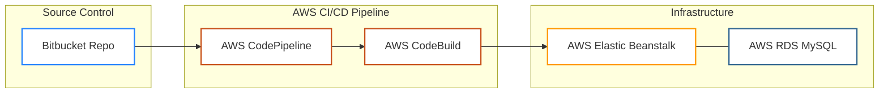

This project demonstrates the "Re-platforming" of a multi-tier Java application (VProfile) from a local/on-premise setup to a fully automated AWS Native CI/CD stack. The goal was to eliminate manual deployment overhead and leverage managed services for high availability and scalability.

Key Features:
Version Control: Migrated source code from GitHub to Bitbucket to utilize Bitbucket webhooks with AWS.

Continuous Integration: Automated Maven builds using AWS CodeBuild.

Continuous Deployment: Blue/Green-style deployments using AWS Elastic Beanstalk.

Database Management: Managed MySQL instance via AWS RDS with optimized security groups.

Orchestration: AWS CodePipeline linking all stages from code commit to live production.

### 🏗 Project Architecture

🏗 Architecture

The workflow starts with a Bitbucket push, triggering a build in CodeBuild, and deploying the resulting WAR artifact to Elastic Beanstalk, which communicates with an RDS MySQL backend.

🚀 CI/CD Pipeline Details

1. Source (Bitbucket)
I migrated the vprofile-project from GitHub to Bitbucket to practice cross-platform VCS migration and integration.

Trigger: Any commit to the main branch triggers the pipeline.

2. Build (AWS CodeBuild)
Using a custom buildspec.yml, CodeBuild:

Installs Java 17 and Maven.

Runs unit tests and packages the application into a .war file.

Uploads the artifact to an S3 bucket for deployment.

3. Orchestration (AWS CodePipeline)
The pipeline ensures that the application is only deployed if the build and test phases pass, providing a fail-safe mechanism for production updates.

💻 Infrastructure & Deployment

Elastic Beanstalk (Web Tier)
Platform: Tomcat 10 with Corretto 21.

Environment: Production-grade environment with auto-scaling capabilities.

AWS RDS (Database Tier)
Engine: MySQL Community.

Connectivity: Security groups configured to allow traffic only from the Beanstalk security group on port 3306.

🏁 Final Result

The application is live and successfully communicating with the RDS database. You can access the login page via the Elastic Beanstalk environment URL.

🛠 How to Run

Clone the repo:  git clone https://awscicdproject21-admin@bitbucket.org/awscicdproject21/vproapp.git

AWS Setup: Create an RDS instance and update src/main/resources/application.properties with your DB endpoint.

Deploy: Set up the Beanstalk environment and link it to your CodePipeline.
